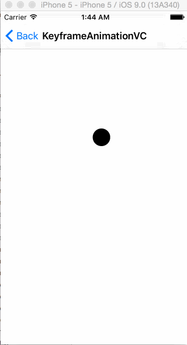

# CoreAnimation
CoreAnimation示例

# CJPopup
弹出视图(包含类似美图的弹出下拉控件CJPDropDownView)

## Screenshots



## How to use
- ①、xxxx的使用
```

```


- ②、xxxx的使用
```

```

- ③、xxxx的使用
```

```

- ④、xxxx的使用
```

```


