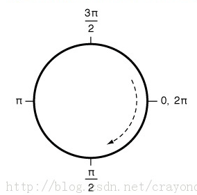
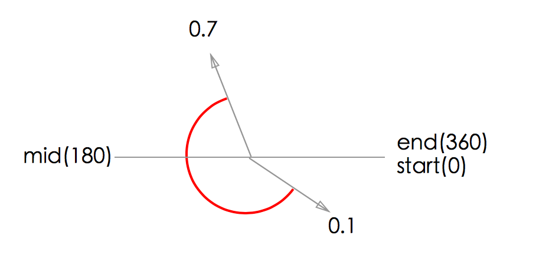
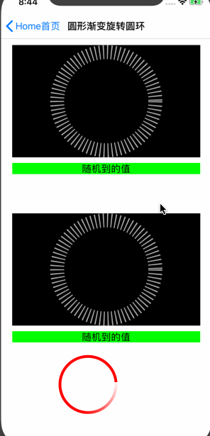

# CoreAnimation
CoreAnimation示例

## Screenshots


## How to use
- ①、xxxx的使用

```

```


- ②、xxxx的使用

```

```

- ③、xxxx的使用

```

```

- ④、xxxx的使用

```

```


## 贝塞尔曲线（UIBezierPath）
贝塞尔曲线（UIBezierPath)实际上就是画一条线，而我们之所以会看到一个区域，其实是因为它把这条线上的区域给填充了。好比我们绘制一个圆弧，但有时候我们看到的是一个圆，其实是我们将圆弧围城的区域给填充fillColor了。

**所以，我们绘制的线实际上`路径path`、`线宽lineWidth`、`线色strokeColor`组成的。而填充色是`fillColor `。**


UIBezierPath方法的重要参考：[贝塞尔曲线（UIBezierPath）属性、方法汇总](http://www.cnblogs.com/zhangying-domy/archive/2016/07/04/5640745.html)

UIBezierPath的使用参考：[放肆地使用UIBezierPath和CAShapeLayer画各种图形](http://www.cocoachina.com/ios/20160214/15251.html)
```
/**
 *  创建圆弧
 *
 *  @param center       圆点
 *  @param radius       半径
 *  @param startAngle   起始角度(一般为0)
 *  @param endAngle     结束角度(一般为M_PI * 2)
 *  @param clockwise    是否顺时针方向
 */
+ (instancetype)bezierPathWithArcCenter:(CGPoint)center
                                 radius:(CGFloat)radius
                             startAngle:(CGFloat)startAngle
                               endAngle:(CGFloat)endAngle
                              clockwise:(BOOL)clockwise;
```
圆弧arc起始位置参考图


```
/**
 *  创建带有圆角的矩形（该矩形所有的角都为圆角，附当矩形变成正圆的时候，cornerRadius就不再起作用）
 *
 *  @param rect         矩形的Frame
 *  @param cornerRadius 矩形角的弧度大小
 */
+ (instancetype)bezierPathWithRoundedRect:(CGRect)rect cornerRadius:(CGFloat)cornerRadius;


/**
 *  创建带有圆角的矩形（可设定特定的角为圆角）
 *
 *  @param rect         矩形的Frame
 *  @param corners      指定该矩形的哪些角为圆角
 *  @param cornerRadii  矩形角的弧度大小
 */
+ (instancetype)bezierPathWithRoundedRect:(CGRect)rect byRoundingCorners:(UIRectCorner)corners cornerRadii:(CGSize)cornerRadii;


/**
 *  创建在rect里的内切曲线
 *
 *  @param rect    矩形的Frame
 */
+ (instancetype)bezierPathWithOvalInRect:(CGRect)rect;
```


#### 刻度盘动画
strokeStart&strokeEnd
> 

刻度圆盘
> 
